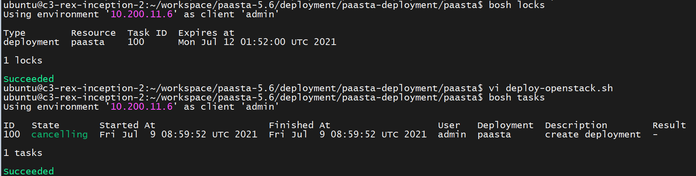
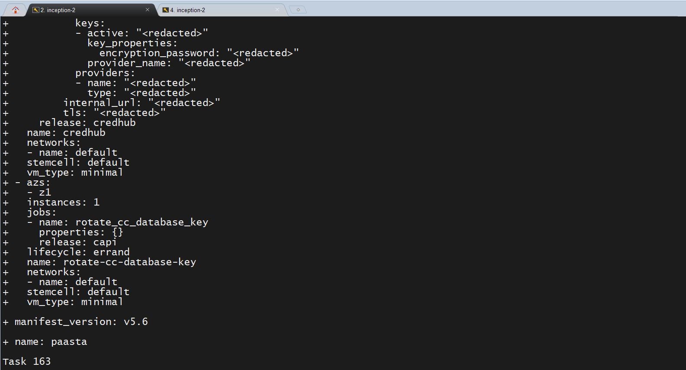
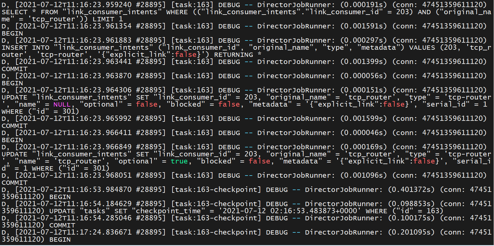
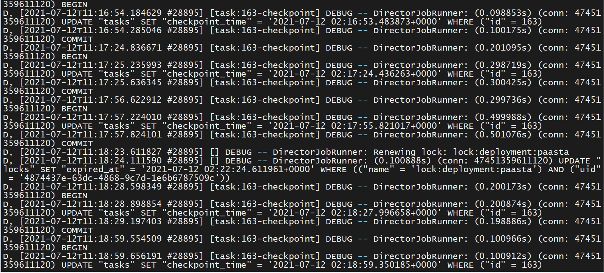

# PaaS-TA 배포시 Lock 이슈

## 1. 이슈 내용

### 1.1 장애 상태



위와같이 PaaS-TA 배포 task(Task 100) 가 passta deployment 에 대해 lock 을 잡고 종료 되지 않는 문제가 발생했다. Cancelling 상태에서 1시간 이상 기다려도 해당 task 가 종료되지 않았다.

### 1.2 재 배포 시도



해당 상태에서 배포명령을 수행하였는데 특정 task(Task 163) 에서 배포작업이 멈추는 현상이 발생했다. 위와 같은 상태에서 작업 진전 없이 계속 멈춰서 진전이 없었다.

해당 task 의 debug 로그를 출력해보면 아래와 같다.



위와 같이 link_consumer_intents 삽입 및 수정 작업 중 어느 순간 추가 작업을 진행하지 않고 checkpoint 만 생성하고 있는 것을 확인할 수 있었다.



이후 계속해서 lock 을 renewing 하고 checkpoint 를 생성하는 작업만 반복하고 있는 것을 확인할 수 있다.

## 2. 원인 파악

### 2.1 원인 예측

1. Bosh 는 Bosh DB에 VM 혹은 Cloud-config 와 같은 환경들을 저장하고 사용한다. 이 때 DB CUD 작업에 동시에 들어가면 락이 걸릴 수 있다.
2. 통신 장애 시에 Health monitoring 작업은 에이전트로 부터 상태를 보고받을 때 까지 계속해서 요청을 보낸다. 때문에 큐가 안끝나서 배포시 락이 걸릴 수 있다.

두가지 원인 중 1번의 경우 여러 사용자가 동시에 Bosh 환경을 사용하는 경우 발생하는 문제로 이번 작업의 경우 본인 혼자 진행했기 때문에 가능성이 낮았다. 2번에 가능성을 두고 문제를 더 살펴 보았다.

### 2.2 원인 확인

**Subnet  설정 오류 및 통신 장애시 Health monitoring 작업** 이 원인이었다. 해당 task(Task 100) 의 디버그 로그를 확인해본 결과 계속해서 VM 생성 요청과 Helth check 요청을 배부한 것을 확인 할 수 있었다.

이런 문제가 발생한 근본적인 원인은 배포시 openstack-cloud-config.yml 설정에서 AZ 의 subnet 설정 부분이 잘못 되어 있었기 때문이었다.

<u>한마디로 위의 이슈는 접근할 수 없는 다른 네트워크에 VM 생성 요청 및 Health check 명령을 보내며 배포중인 paasta Delpoy 에 lock 을 유지하고 있는 상황이다.</u>

## 3. 문제 해결

### 3.1 Lock 해제

해당 Lock 을 해제하는 방법은 약 3가지로 구분해 볼 수 있다.

1. Bosh director 에 직접 접속해서 Bosh DB 에서 Lock 을 직접 삭제하는 방법
2. 해당 task 를 종료 시키고 clean-up 을 통해 Lock 을 삭제하는 방법
3. Bosh director 를 다시 배포하는 방법
    각 방법에 대해서 아래에서 자세히 살펴보자.

#### 3.1.1 Bosh direcotr 에 접근하여 DB 에서 Lock 을 제거

해당 방식의 경우 [링크](https://www.starkandwayne.com/blog/unlocking-bosh-locks/)를 참조했으며 Bosh 버전에 따라 DB의 위치가 다를 수 있음을 참고하자.

- Jumpbox 를 이용해 Bosh director 접근
    + jumpbox.key 및 로그인 설정이 되어 있다는 전제하에 진행.

```
$ ssh jumpbox@10.200.11.6 -i ~/workspace/paasta-5.6/deployment/paasta-deployment/bosh/jumpbox.key
```

- Bosh DB 접근

```
$ sudo -i
# monit stop all
# monit start postgres
# /var/vcap/packages/postgres-9.4/bin/psql -U vcap bosh
```

- Lock 확인

```
SELECT * FROM locks;
```

- Lock 삭제

```
DELETE FROM locks WHERE id={LOCK ID}
```

- 릴리즈 재 가동

```
monit start all
```

#### 3.2.2 task 종료 및 Clean-up

Bosh director 에 접근해 모든 release 를 정지 시키고 해당 task를 cancel 시킨다. 이후 Clean-up 명령을 통해서 Lock 을 제거한다

- Bosh director 접근 까지는 3.2.1 과 동일

- 루트 권한 획득

```
$ sudo su (이후 지정한 Password 입력)
```

- 릴리즈 정지

```
$ monit stop all
```

- Inception 으로 돌아와 task cancel

```
$ bosh cancel-task 100
```

- Lock 제거

```
$ bosh clean-up --all
```

- Lock 및 task 확인

```
$ bosh locks$ bosh tasks
```

#### 3.2.3 Bosh director 재 배포

해당 방식의 경우 References 중 openstack-paas-ta-release-script.md 를 참고하여 진행하기 바란다.
